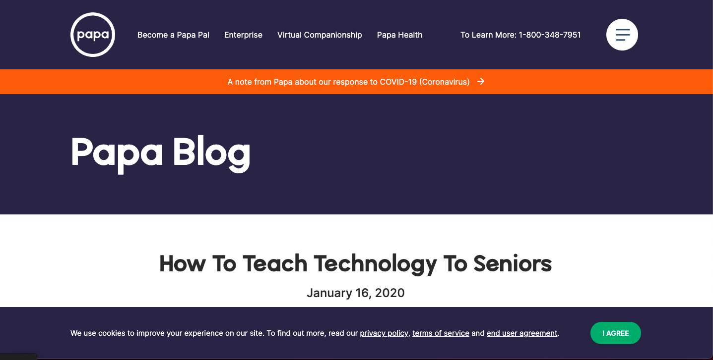
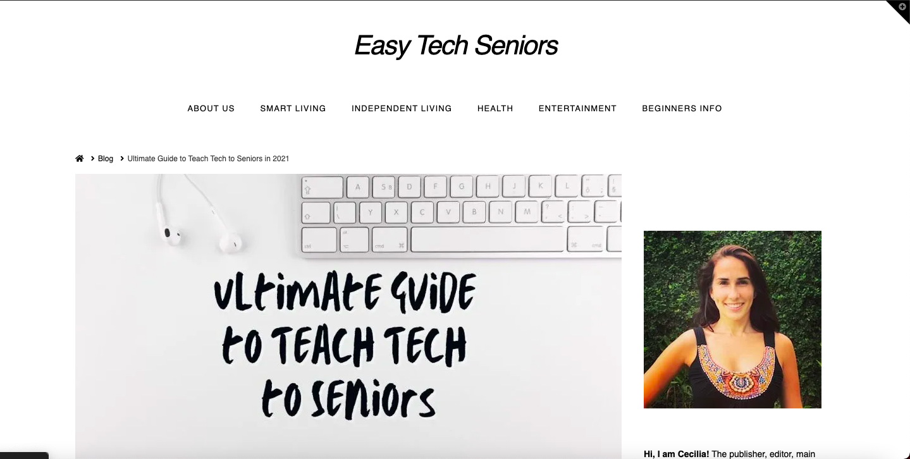

# Teaching Technology to Seniors  
## Joyce Ma - Digital Humanities 110

For my project, I am focusing on teaching the elderly how to use technology, because it is an important skill to have in a world where technology is constantly evolving. The two websites I chose to analyze were displayed on the first page of Google search results, because seniors searching up how to use technology are most likely to click on the first few links they see. As a result, I view these sites as my greatest competitors. The Join Papa site, though it is the first option to click, needs major improvements to successfully teach seniors how to use technology because it lacks important information. The Easy Tech Seniors site, though better than the Join Papa site, could also benefit from formatting changes.

### Join Papa 
*Join Papa is a website for seniors to find younger mentors to teach them things such as how to use technology. It offers other services to seniors as well, such as companionship, help with chores, running errands, and more. Seniors can use this site to book Caregivers to address their needs.* 

https://www.joinpapa.com/blog/how-to-teach-technology-to-seniors

#### Evaluation
*Overall: Because the Join Papa website addresses so many issues at once, their pages do not talk about the topics comprehensively. On the How to Teach Technoogy to Seniors page, the main issues is the lack of useful information. The information provided is extremely basic and vague, and would not be a good source to turn to for seniors inexperienced with technology.*

Heuristic & Description | Join Papa Heuristic Evaluation | Improvement 
--------------------------|---------------------------|------------
**Visibility of system status:** The website includes things such as headers and titles that show users where they are on the page. | **Good:** Each page has a header to show you where you are. Options are highlighted when you hover over them to show you can click them. **Bad:** No other indication of which page you are if you scroll down. | **Improvement:** Allow a scroll to top button for viewers to quickly see the header again, because that is the only way to see where you are.
**Match between system and real world:** The jargon, photos, and icons are easily recognizable and are not difficult to understand. | **Good:** Everything is easily unerstandable and does not require background knowledge to understand. **Bad:** Lack of icons on the page. | **Improvement:** The website could benefit from more recognizable icons to direct people, because it lacks visually appealing aspects. 
**User control and freedom:** User has options to exit, undo, redo, or go back so they are not trapped. | **Bad:** When you are on a page, you are stuck on the page until you click on another header since there are no buttons. You can go back if you click the back on the browser, but there is no option for back on the page itself. | **Improvement:** Include exit, undo, redo, and back buttons when appropriate.
**Consistency and standards:** Design is consistent throughout the website. | **Good:** Colors, formatting, and words are all the same throughout the website.  **Bad:** Drop down menu color scheme is different than the page, does not look as uniform. | **Improvement:** Change either the website colors or drop down menu colors to match with each other.
**Error prevention:** Allows viewers to catch their mistakes if they accidentally click something. | **Bad:** There are no pop ups that allow you to confirm your submissions and no way to undo an action. | **Improvements:** Include another question asking if the user is sure about their actions so they have the option to rethink.
**Recognition rather than recall:** Make the site easy to navigate by having options visible, so users do not have to remember how to navigate the site. |**Good:** Becuase the website is so simple, there is not much to remember on how to navigate the site. **Bad:** The website could be seen as too basic. | **Improvement:** Add more complexity to the options, but make it very obvious how it works so people do not have to remember complicated patterns.
**Flexibility and efficiency of use:** Cater a website to the user through shortcuts that can be beneficial to both experienced and inexperienced users. |**Bad:** No shortcut options. Everyone has the same options on the site, so it cannot be tailored to anyone. | **Improvement:** Allow shortcut options when appropriate.
**Aesthetic and minimalist design:** The design is easy to digest and understand. |**Good:** Simple design that is not overwhelming to users. Clean and easy to read. | **Improvement:** Design could be leveled up to make it more aesthetically pleasing through icons, images, etc.
**Help users recognize, diagnose, and recover from errors:** Website alerts users of any errors in simple language with a solution. | **Good:** Required fields are highlighted in red and the user cannot move on unless they fill it out. | **No Improvement:** Website successfully alerts users of errors in a non alarming way.
**Help and documentation:** Have an option for users to reach out or search for more information if they have questions. | **Good:** Website includes a number to call for more information. There is also a FAQ page and about page with the option to submit requests. **Bad:** Phone number might not be very effective if the call is not picked up. | **Improvement:** Include a chat function to connect with a team member more directly and efficiently.

#### Severity Rating 
1. Top Priority: Error prevention, Flexibiity and efficiency of use, User control and freedom
2. Important to Fix: Visibility of system status, Flexibility and efficiency of use, Help and documentation
3. Small Inconvenience: Match between system and real world, Consistency and standards, Recognition rather than recall, Aesthetic and minimalist design, Help users recognize, diagnose, and recover from errors

### Easy Tech Seniors
*Easy Tech Seniors is a blog deicated to helping seniors transition smoothly into old age. The site includes smart living, independent living, health, entertainment, and beginners info for seniors. This particular blog post focuses on how to teach seniors to use technology.*

https://www.easytechseniors.com/ultimate-guide-to-teach-tech-to-seniors-2/

#### Evaluation 
*Overall: Easy Tech Seniors provides a lot of information and tips on how to teach technology to seniors, but the overload of information may be overwhelming and difficult to digest. It could be beneficial to break up some of the pages into smaller sections to make it cleaner. The website needs to be improved, but it is better than the Join Papa site.*

Heuristic & Description | Easy Tech Seniors Heuristic Evaluation | Improvement 
--------------------------|---------------------------|------------
**Visibility of system status:** The website includes things such as headers and titles that show users where they are on the page. | **Good:** Website includes headers and titles to keep users informed of what they are reading. **Bad:** The pages are very long and hard to keep track of where you are on the page. | **Improvement:** Include a bar on the side to show how far down the page you are. Have a drop down menu to select the specific section you want to read.
**Match between system and real world:** The jargon, photos, and icons are easily recognizable and are not difficult to understand. | **Good:** The overall language and photos are easy to understand. **Bad:** Includes a section of tablets and technology to buy, might be confusing or difficult for seniors to understand without explanation. | **Improvement:** Explain the language used when presenting the technology options. 
**User control and freedom:** User has options to exit, undo, redo, or go back so they are not trapped. | **Good:** Website includes a go back and go forward button to change between pages. **Bad:** There are no undo or redo buttons and users have to scroll to top to go forward or back. | **Improvement:** Have the go forward/go back button follow you as you scroll down so you can move pages at your convenience.
**Consistency and standards:** Design is consistent throughout the website. | **Good:** Website uses the same format and stlye throughout with same font and color scheme. | **No Improvement:** Design is not confusing and easy to follow. 
**Error prevention:** Allows viewers to catch their mistakes if they accidentally click something. | **Bad:** No option to double check before submitting a comment. No option to edit after posting. | **Improvement:** Ask before allowing users to post onto the website, in case they did not mean to.
**Recognition rather than recall:** Make the site easy to navigate by having options visible, so users do not have to remember how to navigate the site. | **Good:** Because the layout of the site is the same throughout, there are no major things to memorize, which makes the site easy to use. | **No Improvement:** Website does not require outside knowledge or memorization to effectively use.
**Flexibility and efficiency of use:** Cater a website to the user through shortcuts that can be beneficial to both experienced and inexperienced users. | **Bad:** No shortcuts available to advanced users. | **Improvement:** Include keyboard shortcuts or other forms of shortcuts to allow users to change between pages quickly.
**Aesthetic and minimalist design:** The design is easy to digest and understand. | **Good:** Overall, the website is clean and not cluttered. **Bad:** The page is very long and can be seen as messy because it is not broken up. | **Improvement:** Move things such as which tablets to buy as another link or another page, so users have the option of clicking if they are interested.
**Help users recognize, diagnose, and recover from errors:** Website alerts users of any errors in simple language with a solution. | **Good:** Require fields are marked as required, which helps users recognize what they need to include in order for the action to go through. | **No Improvement:** Does not have confusing error pop ups.
**Help and documentation:** Have an option for users to reach out or search for more information if they have questions. | **Good:** Includes a list of links to click for more information and an about us page. **Bad:** No option to give feedback and no FAQ. | **Improvement:** Create an FAQ and offer a way for readers to send tips and concerns without having to comment on the posts themselves.

#### Severity Rating 
1. Top priority: Help and documentation, Error prevention, Flexibility and efficiency of use
2. Important to fix: Visibility of system status, User control and freedom, Aesthetic and minimalist design
3. Small Inconvenience: Match between system and real world, Consistency and standards, Help users recognize diagnose and recover from errors

Template Credit: Emily DePressi
