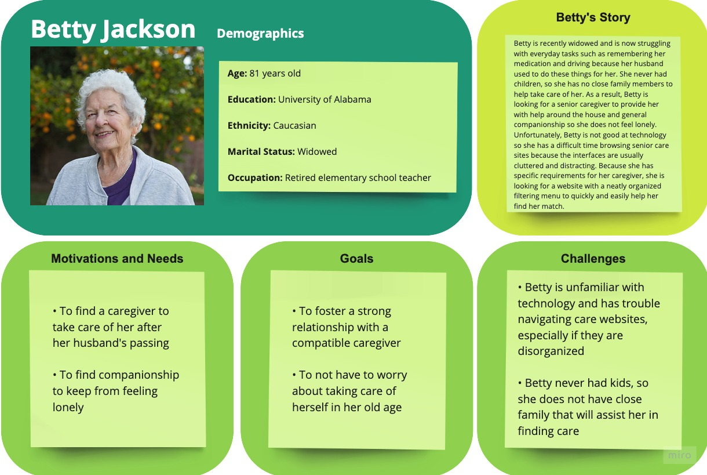
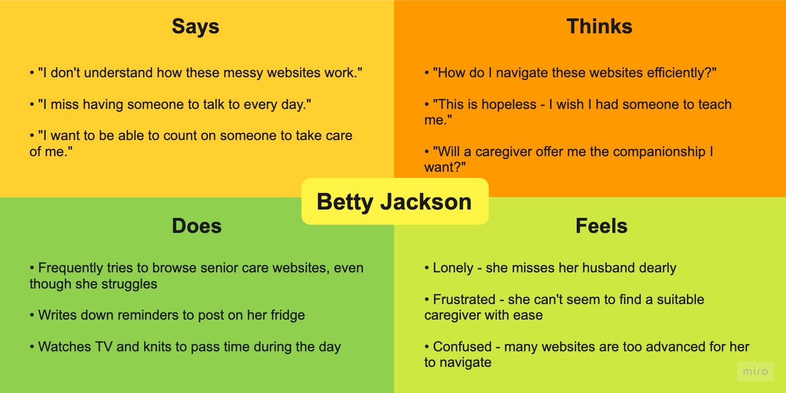
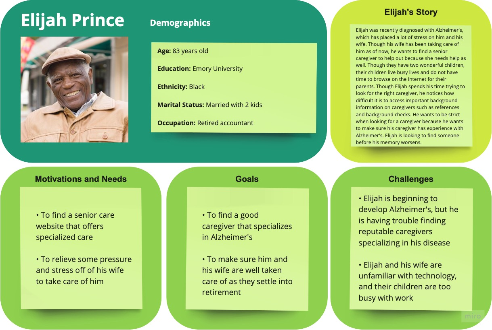
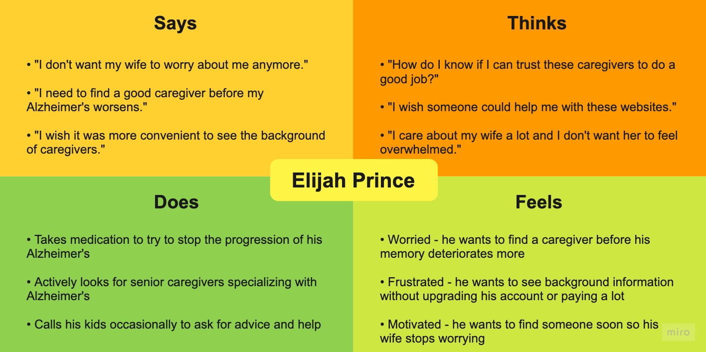
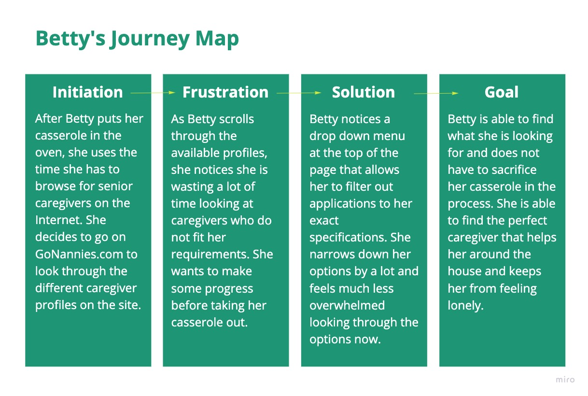

# DH110-ASSIGNMENT04
## Purpose of UX Storytelling
UX storytelling is important because it helps us visualize and understand our target audience better through the creation of personas and situations. By analyzing the things members of our target audience say, think, do, and feel, we can view our product from the eyes of a user to tailor the product to improve overall user experience. UX storytelling offers a much more comprehensive outlook on the users themselves and help us shed our biases, which allows us to create the best product we can.

## Design Features
1. Filters - include more specific filters and organize into an easy menu

2. Caregiver profiles - make background information on caregivers more accessible

## Persona and Empathy Maps
### 1. Betty Jackson

### 2. Elijah Prince

## Scenerios and Journey Maps
### Betty's Scenario
• Betty is an 81 year old senior whose husband recently passed away, leaving her without close family to take care of her in her old age. Her and her husband never had children, so she had always relied on her husband to help her remember her medications and help her around the house. Betty spends her free time catching up on television shows and knitting sweaters, but she cannot help but feel lonely and helpless. On top of everything, she is unfamiliar with technology and has trouble browsing the Internet for senior care. Betty is in the market for a senior caregiver who is willing to move in with her to provide her with companionship and assistance in her old age. 

• After a long day of knitting, Betty tries going on the Internet again to look through some senior care websites to hopefully find a good caregiver for her to hire. After Googling "senior caregivers near me," she settles on GoNannies.com to continue her search. As she scrolls through the website, she finds herself scrolling through columns of caregiver profiles that do not fit exactly what she is looking for. She knows she wants a live in, female, non-smoking caregiver who speaks English and has a valid Driver's License, but Betty notices how tedious it is to scroll through so many profiles that do not match. Betty starts to worry as she smells her casserole burning in the oven and knows she has to hurry up her search. Fortunately, she finds a filtering option in a dropdown menu that allows her to tailor her requirements exactly to her liking. She clicks all the boxes that are important to her and presses search. 10 profiles pop up instead of the original 50, and Betty feels much better finding a more narrow list of applicants. She goes to save her casserole and returns to slowly leaf through the remaining profiles.

### Chelsea Smith's Scenerio
• Chelsea is a young, stay-at-home mother of 3 children, all under the age of 10 years old. When she is not picking or dropping them off at school/daycare/soccer practice, cooking dinner, cleaning the house, or supervising them, Chelsea is updated her popular mommy blog where she posts about her family, advice on how to balance life with three young kids, and fun events. She is planning on posting a blog post about her friend's upcoming baby shower. Her friend is having a girl and the baby shower will have a pink theme. Since Chelsea wants to take lots of pictures at the baby shower for her blog, she wants to buy a new pink dress in her size (size 6) that costs under $50 so she will look presentable in her photos. Unfortunately, she has no time to go to the mall over the next couple of weeks because she needs to take care of her kids who are home for the summer. Chelsea decides to look for her dress online so that she can shop while also keeping an eye on her kids.

• Chelsea finds a few minutes to open her laptop and sit at the dining room table. She goes onto Amazon and types "dress" in the search bar at the top of the main page and presses the button with the magnifying glass icon to search for results. The page shows a list of dresses, but Chelsea directs her attention to the left-side column of the website where the filters are located. Chelsea is able to view all the filters such as "color,""price,""reviews,""style," and "size." She is pleased that she can see all of the filters at once so she knows what she can adjust. All of the specific features for each filter type is hidden until Chelsea clicks the downward-arrow icon next to the title of the filter she wants to adjust. Since Chelsea is looking for a size 6, pink dress under $50, she clicks the downward-arrow for "size," and clicks the button labeled "6," then clicks the arrow for "color" and selects the pink rectangle, and clicks the arrow next to "price", types in "$0" in the "Min" text box and "$50" in the "Max" text box. Once she has finished adjusting all of her filters, she presses the button labeled "Go" at the bottom of all the filters. The page refreshes and shows dress results that fit Chelsea's filter adjustments. Chelsea feels like she has saved a lot of time because she was able to adjust three different filters and did not have to wait for the entire website to refresh between each adjustment. Chelsea quickly browses thtough the selection of dresses until she finds a dress she likes, knowing that it will be available in her size and fit her price range. She clicks the item's picture and clicks the button labeled "Add to Cart" to purchase the item. Chelsea closes her laptop and goes to the living room to keep an eye on her kids, feeling excited about her new dress and pleased that she was able to narrow down her choices and find a dress specified to her liking so quick and efficienty.

### Mary Benson's Scenerio
• Mary Benson is a retired middle school teacher who spends her days experimenting with her new Macbook Pro at home with her husband. Since it is a hasstle for both of them to bring the laptop charging cord from one room to another, Mary and her husband decide to purchase a spare laptop charger. Mary makes her first ever purchase off Amazon, but does not realize that she bought a laptop charger for the previous Macbook generation. She wants to return the charger back to the seller and be refunded so she can buy the correct charger. Since this is her first time trying to return something to Amazon, she is unsure of what to do and goes onto the website to look for more information. Mary tries to look for a "Help" or "Assistance" button, but she can not find it with the current Amazon design. 

• After Mary Benson realizes she has bought the wrong charger, she goes to the Amazon website to look for help. She finds a button labeled "Help" located at the top of the screen to the right of the top seach bar and Language settings. She clicks the "Help" button which redirects her to a page that has a list of help topics that are most searched such as "Returns and Refunds," "My Orders," "Payments," "My Account," and "Device Support." There is also a search bar at the bottom of the list where users can type in keyboards of something they need help with and a "Contact Amazon" button underneath the search bar so users can contact Amazon directly with any concerns or help. Mary clicks on the button labeled "Returns and Refunds" and is redirected to another page that provides information about Amazon's return policy. At the very top of the screen is a button labeled, "Start a Return in Your Orders." Mary clicks this button and is redirected to a modified "Your Orders" page that now has buttons for each item that allow users to return the item. Mary clicks the button labeled "Return or replace items" on the charger she bought by mistake and continues to successfully complete her return. From there, Amazon's return experience guides Mary through the process of printing the return label, taping it onto the sealed package with the returned item, and dropping it off at the post office. Mary feels relieved once she returns her package and looks forward to her refund. She is pleased that she able to find a guide through Amazon's return process quickly from the main page and she did not have to navigate from one step to the next by herself.

