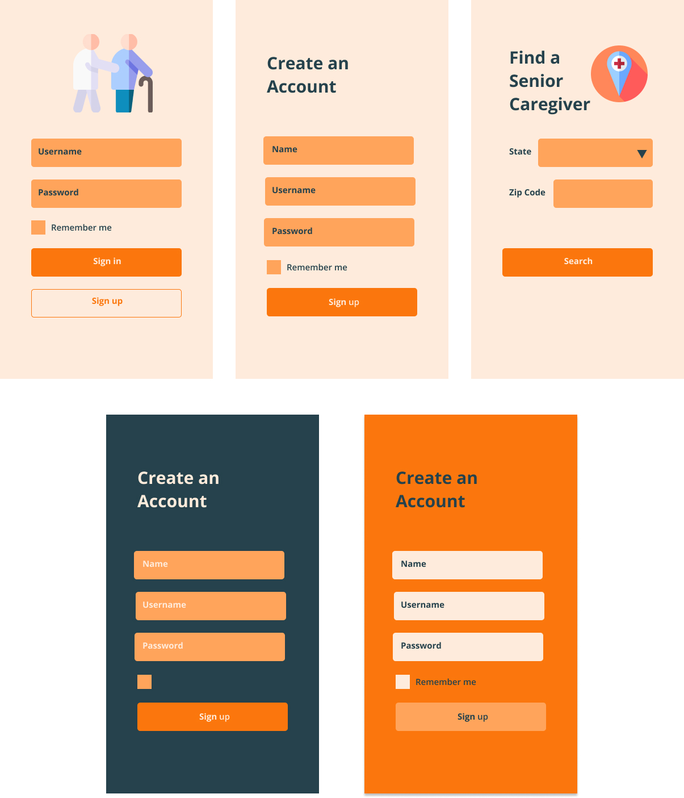
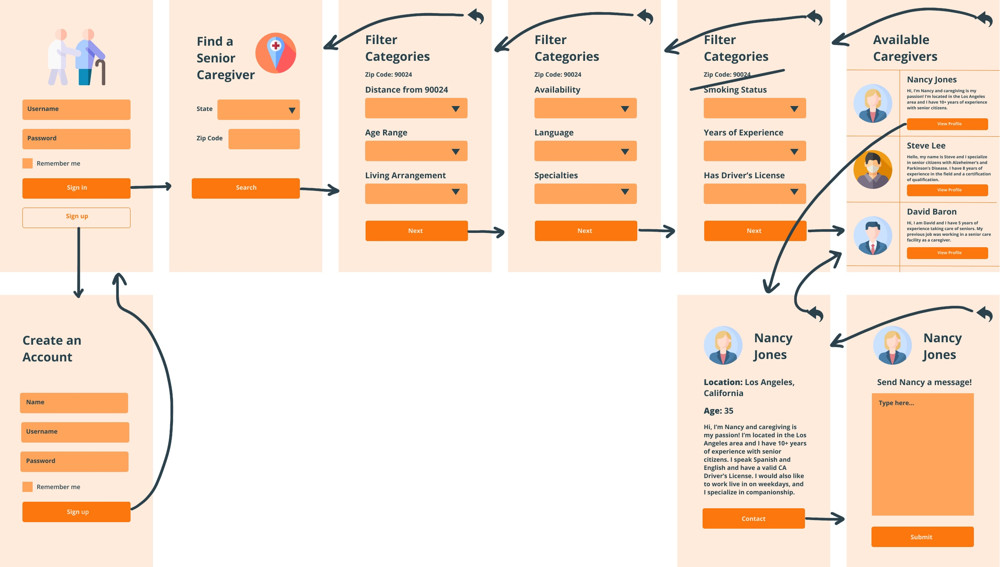
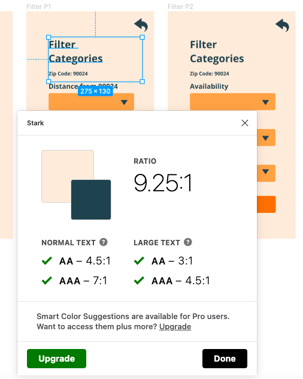
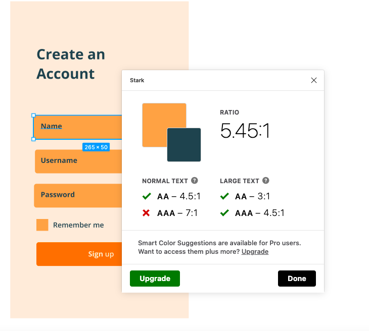
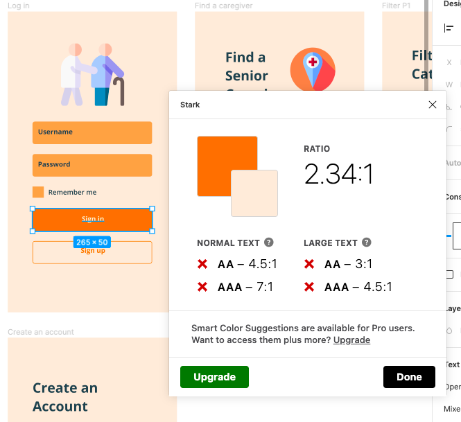

# DH110 Assignment 6: High-Fidelity Prototype (Part One:Yellow)

## Joyce Ma 

## Overview

**Description of Project:** My project centers around providing seniors an accessible app to use when looking for senior care. Because many eldery people find it difficult to navigate technology, my goal is to design an app with an appropriate color scheme, font, and flow to increase usability and allow elderly people to find what they are looking for with ease. 

**Purpose of Prototyping:** The purpose of this high fidelity prototype is to map out a detailed version of the app design to test any flaws in usability. The prototype will allow us to see if certain tasks are easily completable and what needs to be changed to allow for a better user experience.

**Process of Prototyping:** The high fidelity prototype was created on Figma, a web-based prototyping tool. On Figma, I turned the low fidelity prototypes into high fidelity prototypes by implementing actual usable features and creating a consistent design theme throughout the wireframes. The general aesthetic was designed with seniors in mind and the tasks chosen were tasks that will be commonly completed within the app when it is ready to use.

## Tasks

**Task 1: Using a specialized filter to help narrow down caregiver options**
>In this task, Betty (the associated user persona) opens the senior care app and logs in. She is then directed to the Find a Senior Caregiver page, where she is prompted to input her state and zip code. After, she can choose her desired filters such as distance, age range, living arrangement, availability, etc. to find her perfect care giver. She then presses Next and is routed to the page of available caregivers, which she can scroll through to find someone she likes. She presses View Profile on a caregiver to see her profile and presses Contact. Betty writes a message and presses Submit. 

**Task 2: Organizing caregiver profiles to make background information more accessible**
>In this task, Elijah (the associated user persona) opens the senior care app and logs in. He has already inputted his desired filters so he is automatically redirected to the available caregivers page, where he was last. He finds a caregiver he likes and clicks View Profile and is redirected to the caregivers profile. Elijah then scrolls down to the Background Information section of the profile and has the options to click Background Check, References, or Qualifications. Each link takes Elijah to a different screen where he can see the respective information. 

## Screen Design

The three distinct templates I created for the screen design were the Log In page, the Create an Account page, and the Find a Senior Caregiver page. These screens have graphic design components such as a consistent color scheme, recognizable icons, input boxes, buttons, and drop down menus. I created 3 different variations of the Create an Account screen, including a light mode, dark mode, and in between mode. 

## Wireflows

**Using a specialized filter to help narrow down caregiver options**

Link to Interactive Prototype: https://www.figma.com/proto/7pH1Hx47cAEklWXNQFv7lY/DH110-Wireframes?node-id=5%3A23&scaling=scale-down&page-id=0%3A1

**Organizing caregiver profiles to make background information more accessible**

[Task_2_Wireflow](Task2Wireflow.jpg)

Link to Interactive Prototype

### Graphical Interface Design Explanation

For my app, I wanted to make it simple and accessible for seniors to use. After conducting some research on appropriate color schemes, I found that seniors have difficulty differentiating between blues and greens and respond better to warm colors, such as orange and red. As a result, I decided to choose a warm color scheme with mainly orange tones to make it easier for seniors to view the app. I also wanted to keep the interface minimal and not cluttered so users would not be distracted or confused trying to find the next step. Many of the input boxes are familiar and do not require a lot of technological knowledge to figure out, so the pages should be intuitive for users to use. The rectangular boxes have slightly rounded corners to give off a more modern and soft look rather than harsh, sharp corners. I also incorporated recognizable icons on some screens when appropriate as another method tolet users know they are on the right page, and I chose a clean font to avoid readability and legibility issues.

## Impression Test

## Accessibility Check

The colors in my design are dark blue/green (25424C) which is mainly used for text, cream (FFEBDB) which is used for background, and light orange (FFA45B) and dark orange (FB770D) which are used as accent colors. The majority of the text on the app is dark blue/green (25424C) on either light orange (FFA45B) or dark orange (FB770D), which both passed the Stark plugin color contraster check on the WCAG 2.0 AA level. Light orange (FFA45B) on dark orange (FB770D), or vice versa, did not pass the color contrast test. For future revisions, I will keep all my text the dark blue/green (25424C) color to make sure it can be read easily, especially for senior citizens.

## Design System

**Typeface:** The font I chose was Open Sans because of its legibility and clean look. I wanted a font that was easy to read and aesthetically pleasing, and I believe Open Sans works very well. Open Sans is a humanist sans serif typeface and is popular in flat design-style web design, offering a pleasant reading experience for app users. For font size I chose 30 for page headers, 20 for subheaders, and 15 for buttons and all other labels. 

**Color Scheme:** I used 4 colors in my color scheme, including dark blue/green (25424C), cream (FFEBDB), light orange (FFA45B), and dark orange (FB770D). I chose 
cream (FFEBDB) as the background color because it is the lightest and provides a clean background for the other colors to sit on top of. I chose dark blue/green (25424C) as the primary text color because it is the darkest and contrast the most with all of the other colors. I used light orange (FFA45B) and dark orange (FB770D) as accent colors for buttons, input boxes, and dropdown menus because they contrasted well enough with the background and primary text to create distinctions, even if they did not work as well as font colors. 

**Layout Grid:** All icons, buttons, and boxes are centerd along the center of the screen. Text is usually aligned to the left, but it is centered on buttons. The text and buttons are equally spaced from each other, but the exact measurements vary across different screens because each screen is adapted to allow everything on it to fit nicely. 

## Reflection
