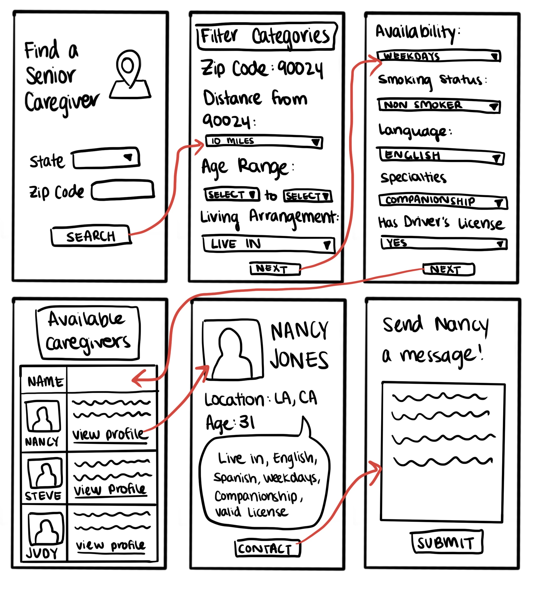
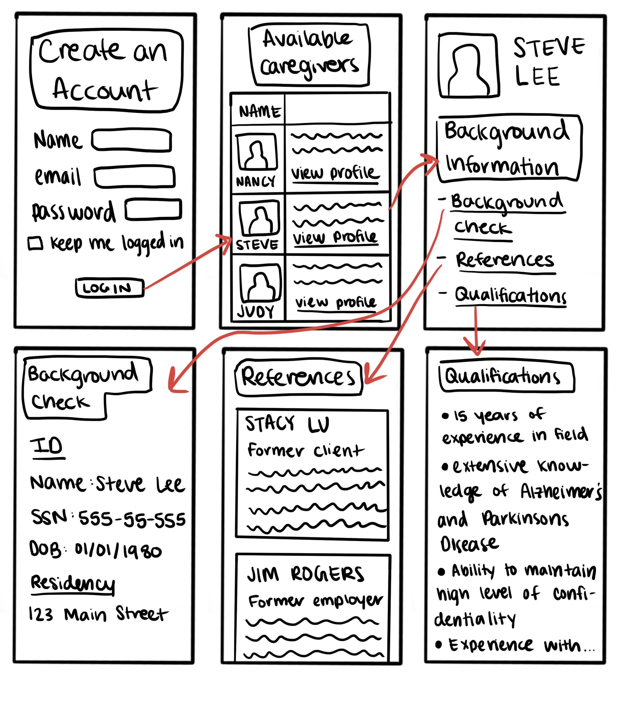

# Assignment 05: Low-Fidelity Prototype

Joyce Ma  
DH110: User Experience Design 

## Project Description

My project focuses on developing a platform that allows senior citizens to find senior caregivers easily and efficiently. Because many of the current options are outdated, cluttered, confusing, or not specific enough, I aim to combat all these issues when developing my prototype. The type of user persona I imagine will be using my website/app can be characterized as elderly people who can no longer take care of themselves, who are not super proficient with technology, and who want to look for caregivers themselves instead of asking a friend or family for help. The website/app I aim to build will be helpful and easy for seniors to use themselves. 

The purpose of the low fidelity prototype is to create a general layout of how my platform will look and function. By mapping out the general flow of the screens, I will be able to gain a better understanding of how everything will look in the end and where the problem areas are. By testing the low fidelity prototype, I can see which features are actually functionable and useful and which are confusing and unnecessary. The test will allow me to see my product through the eyes of the user to gain important insight which can be applied to improve user experience. My prototype will go through two tasks that target two problems I noticed in the design of other senior care sites. 

## Tasks
This low-fidelity prototype aims to support these two tasks:

1. Using a specialized filter to help narrow down caregiver options

2. Organizing caregiver profiles to make background information more accessible

## Wireframes and Wireflow

## Prototype Testing 

Both wireframe testing videos can be found [here](https://drive.google.com/file/d/1gD1JWs3l9KELAiOlHeBP5IGmkUFdSoSP/view?usp=sharing) and [here](https://drive.google.com/file/d/1nUeTWztGBFU5JfQkum5VOCzrdpGZ3dkj/view?usp=sharing).

## Reflection 
I believe the prototype testing went relatively smoothly; the user was successfully able to utilize all intended features despite a few minor setbacks. I did not account for the possibility that a user will not need to utilize the price tool and recommendation tool on every interaction. We conducted another walkthrough of the tasks to test these features which were easy and simple for the tester to use given the change in prototype state and system's intended response. I was surprised that the layout and organization of my wireframes were intuitive enough for a first-time user. I believe how often a user travels and uses such websites and/or apps does have a little influence on how well they can understand specific terms, such as inbound and outbound. My user travels a couple of times a year, both domestically and internationally, and readily uses Expedia as her main travel booking site. I decided to follow Expedia's layout and aesthetics when creating my wireframes.

The tester was confused that the review sort and filter returned to the hotel page when she pressed **Done**. I plan to correct my error and direct the flow back to the list of sorted reviews. The tester was hesitant and unsure whether they had to select a specific rating to sort through the results. I believe this can be solved through design and color when creating my digital prototype. I plan to make these options checkable through checkboxes which are optional in most design aesthetics. In addition to these changes, while this was not mentioned during user testing, I would draw out the flow for the **See More** button under flights. I believe it would be easier and more efficient for the user to view these details, if necessary, without leaving the app. I also believe it would be convenient for the user to have the **Reset** button on the hotel and flight *Sort* features. 
